# SWD lab walkthrough

## Overview

This is a complete walkthrough of the SWD lab, that is meant to guide you through every step of the way. You can read through this document to perform the lab, but for educational purposes, it is strongly suggested to use the [instructions](./instructions.md) as a main roadmap, and come back here whenever you feel stuck or need a sanity check.

Also, it is important to note that the screenshots may have been taken on a previous firmware release, which can change memory addresses for example. It is normal if some results are not exactly the same, though the solving procedure should not be altered.

> By this point, I assume that you have read through the instructions and understood the goal of this lab.

## Walkthrough

### Set up

> If you have manually flashed firmware on the DVH board, this is the same configuration.

If this has not been done yet, we will install and configure OpenOCD, as explained [here](../../tools/flash.md). We will not dive into much explanation here, but feel free to read the dedicated document. You can install OpenOCD with `sudo apt install openocd` then paste this configuration into a file named `openocd.cfg` :

```
# Source debugprobe interface config file
source /usr/share/openocd/scripts/interface/cmsis-dap.cfg
transport select swd

# Source target (STM32F103C8T6) config file
source /usr/share/openocd/scripts/target/stm32f1x.cfg

# Flashing at 5MHz
adapter speed 5000
```

We can now wire the [Debugprobe](../../tools/debugprobe.md) to the SWD interface of DVH board. They need three wires as mentioned before, SWDCLK, SWDIO and a common ground :

| DVH    | Pico |
|--------|------|
| SWDCLK | GP2  |
| SWDIO  | GP3  |
| GND    | GND  |

You may need to take a look at the pinout for both the DVH board and the [Raspberry Pi Pico](https://www.raspberrypi.com/documentation/microcontrollers/pico-series.html).

<p align="center">
  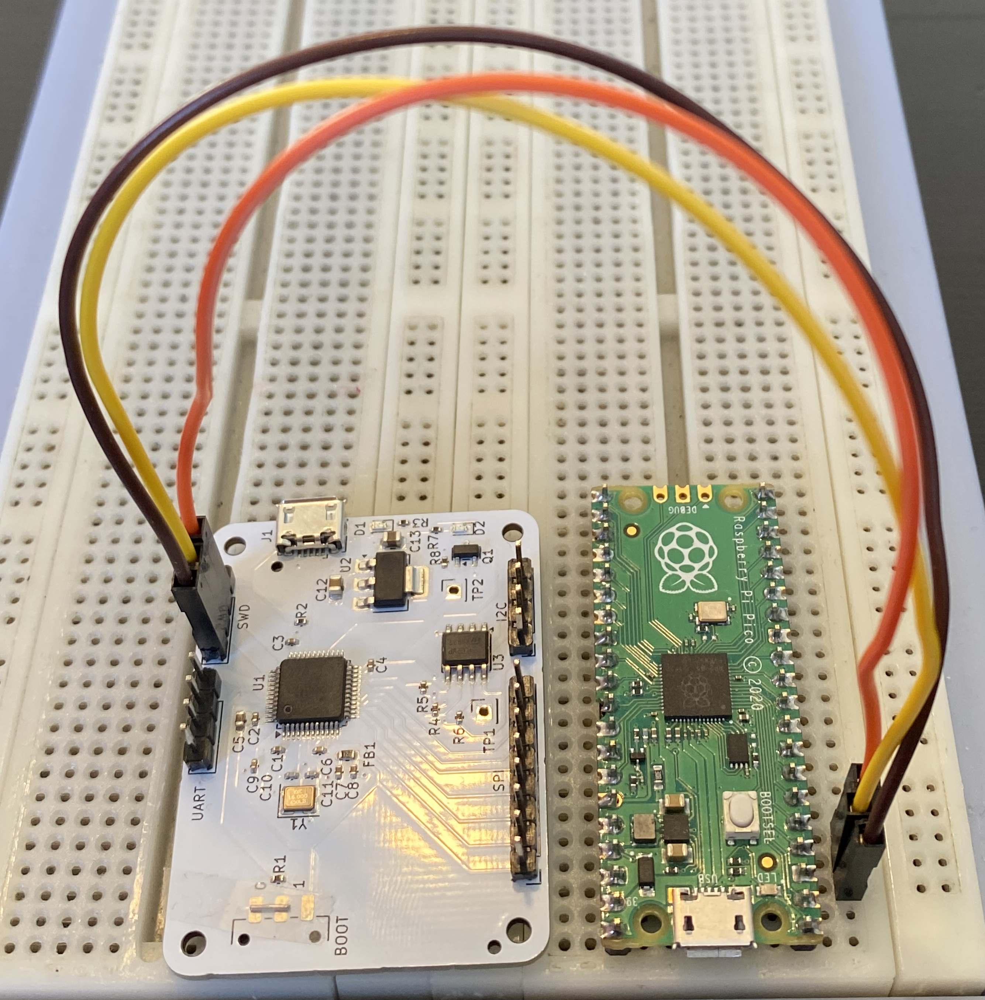
</p>

### Initial access

Once you have set up the boards, you can power them on, while connecting the debugger to your computer. Both boards should have an LED turned on to display that they are correctly receiving current.

In order to dump the firmware, we can execute this OpenOCD command :

```
openocd -f openocd.cfg -c "init; reset halt; dump_image firmware.bin 0x08000000 0x10000; exit"
```

This command initiates a connection with the STM32 chip, tells it to reset and freeze instantaneously. This is very important because it allows the Debugprobe to correctly read the data from the chip. A running MCU would throw errors or incomplete/corrupt data. The command asks to dump the running image to a local file named `firmware.bin`, starting from address `0x08000000` with a flash size of `0x10000` (64kB).

If the dumping executed successfully, you should see a new file `firmware.bin` in your working directory, as well as a similar output tail :

```
[stm32f1x.cpu] halted due to debug-request, current mode: Thread
xPSR: 0x01000000 pc: 0x08000544 msp: 0x20005000
```

Congratulations, you have successfully dumped the firmware that runs on the DVH board !

> If you see this kind of error : `Error connecting DP: cannot read IDR`, it is very likely that your wires are not properly conducting current. It might be helpful to check the chip-to-chip connections with a multimeter.

### File analysis

Now that we have extracted the firmware, we can use a couple command line tools in order to gain a better understanding of what that file is, and see if we can get anyting out of it.

The first tool is the `file` utility. It prints out interesting pieces of information, such at the processor infrastructure and interesting addresses (exception vector table).

```
$ file firmware.bin
firmware.bin: ARM Cortex-M firmware, initial SP at 0x20005000, reset at 0x08000544, NMI at 0x08000368, HardFault at 0x0800036a, SVCall at 0x08000372, PendSV at 0x08000376
```

As you can see in this output, the architecture is `ARM Cortex-M` and for example, the Stack Pointer (SP) initially lives at the address `0x20005000`.

> Note that except for the stack, which grows from high addresses to low addresses, these entries are in fact very close to our base address `0x08000000`.

We can also use another interesting utility to gather more information on our binary file, the `strings` command. This tool will read the binary data, and print out the ASCII characters that it finds. Since the firmware is machine code, most of it will be gibberish, but you will often encounter some interesting strings :

```
$ strings firmware.bin
L#x3
iQHB
?K<H
-J-K
```

There will often be random characters because occasionnally, hexadecimal values in the machine code will actually form strings. By default, `strings` prints any sequence of at least 4 characters, but to filter some of the randomness, we can manually set a higher threshold :

```
$ strings -n 10 firmware.bin
FpGDVH{...............................}
```

Bingo, we found the first flag !

> In this firmware version, some arbitrary ASCII characters `FpG` were also found before the flag. It is a coincidence, and does not pose any problem, but note that this is not part of the flag which will always start with the letters `DVH` unless stated otherwise.

### Static analysis

> This step assumes you have zero experience with Ghidra or similar software. If you do, feel free to skip through some of the paragraphs. Please note that there are multiple ways of solving this section.

Since we still have two more flags to find, we will need to perform deeper research. To help us with that, we can go through a process called static analysis. This means effectively loading the binary and read out its machine code to figure out the original assembly code (disassembly), and a representation of what the source code might have been in C-like syntax (decompiling).

> It is important to understand that decompiled code will never be as good as the source code, and you will always lose data by going through this process, such as function and variable names, comments, and much more. However, this is the closest we can get with only the machine code in this reverse engineering scenario.

To get started, we will launch Ghidra and create a new project (`File > New Project > Non-Shared Project`) :

<p align="center">
  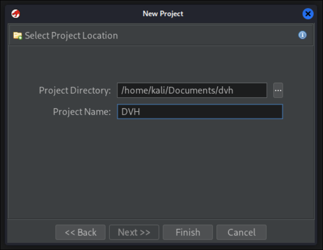
</p>

Once the project is created, you will need to import the firmware file before sending it for analysis. You can do that under `File > Import File` or by pressing the `[I]` key. Sometimes, Ghidra fails to infer the correct architecture type, so you will likely need to select it manually. As we have seen with the `file` command, the architecture is 32-bit ARM Cortex with Little Endian (`ARM:LE:32:Cortex:default`). You will also need to manually enter the base address, which is still `0x08000000`.

> Little Endian is a method of storing memory, where least-significant bits are stored at the lowest addresses. For example, if a register stores `ec ba 9b 87 dd`, the physical value seen in the assembly would be `dd 87 9b ba ec`. On the contrary, Big endian would store it the same way we read it.

<p align="center">
  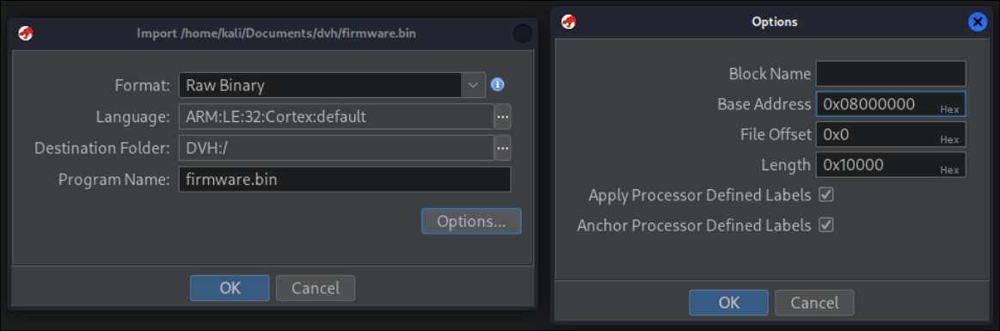
</p>

The file has now been imported into the project. Ghidra gives us multiple tools to perform the analysis. Here, we will use `CodeBrowser` (green dragon head). You can either drag and drop `firmware.bin` onto the `CodeBrowser` icon, or press `[ENTER]` with the file selected. When prompted to analyze the file, click `Yes > Analyze`.

If all goes well, you should see a layout similar as the one below. The sidebar on the left allows you to navigate to known symbols (notably functions) with its `Program Tree`. The center menu displays the flash memory map, including instructions from the disassembled code and stack variables. The menu on the right side shows the decompiled code of the current batch of instructions (when you're hovering code that can be decompiled, such as a function).

<p align="center">
  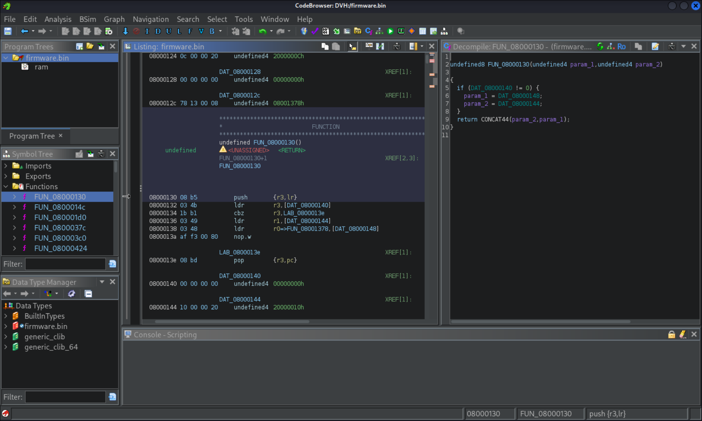
</p>

Let's start searching for the remaining flags. As you can see, there is so much data to scroll through that it will be hard to find anything by hand. At first, it can be difficult to find an entrypoint to the code we wish to inspect. This is the point where we remember that we have already found a flag ! It is fairly likely that related logic (in this example, handling flags for this SWD lab) would be written in adjacent blocks of code (in the same file, maybe even the same function). This means that the logic for handling the next flags may reside in adjoining memory sections in the assembly ! Let's see if we can navigate to the address of flag one by browsing the memory for the actual flag string. To do this, go to `Search > Memory`, or use the shortcut `[S]`. Then select `String` and enter the first flag, and Ghidra will search the memory and fetch the address in memory where it resides :

<p align="center">
  
</p>

Double click on the one entry that pops up, and you will be taken to the corresponding memory location in disassembly (you can close the `Search Memory` window). You may be able to see some string parts, but Ghidra will most likely fail to actually decode the bytes as a real string. If we take a close look at the bytes, we can already see a part of the flag on the bottom : `...............}`.

We can also see that the first bytes of data have a hex value of `44 56 48 7b`. If you go through an ASCII table or use an external tool ([Cyberchef](https://gchq.github.io/CyberChef/) is a good choice, Python can also easily do the trick), you will notice that these values actually correspond to `DVH{`, which is the start of the flag.

> In assembly (and C), strings always end with the terminator character `0x00`. That is probably how Ghidra knew it was a string. If that had not been decoded already, we would have looked for the hex representation of `}` followed by the string terminator : `7d 00`

<p align="center">
  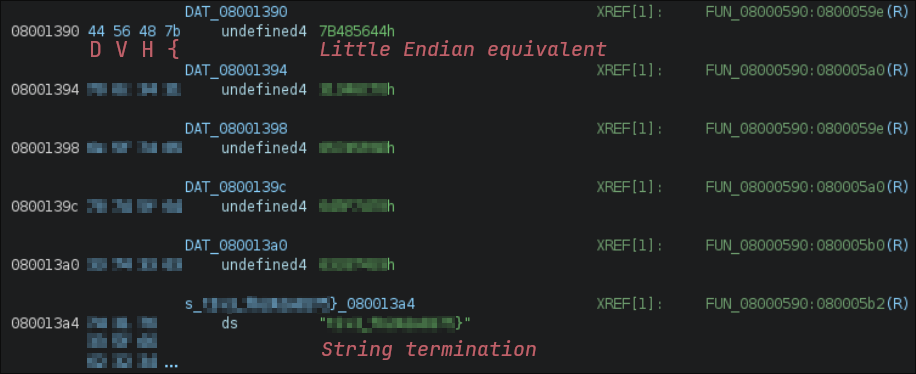
</p>

We could leave these addresses like this, but a good practice when reverse engineering is to format the code in a way that is readable for us. We will thus tell Ghidra to display the whole flag as a single string, by selecting all blocks from `DVH{` through `}`, then `[Right Click] > Data > string`. This will now display the complete flag. One more thing that we can do is `[Right Click] > Edit Label`, or `[L]` to give a meaningful name to that data (`FLAG_ONE` for example). You should now have something similar to the screenshot below.

> Do not hesitate to overly label any piece of code or data that you find interesting, even if this guide does not go through that process every time. The end goal is to make sense out of the code, so anything that makes it clearer for you is a step forward.

<p align="center">
  
</p>

We have now sorted out flag one. As we said earlier, it might be interesting to see where that flag is used in the code, to check if the other two flags are near. `[Right Click] > References > Show References To Address` will show you a couple of references, but only one is valid, which makes it fairly easy for us to choose. 

<p align="center">
  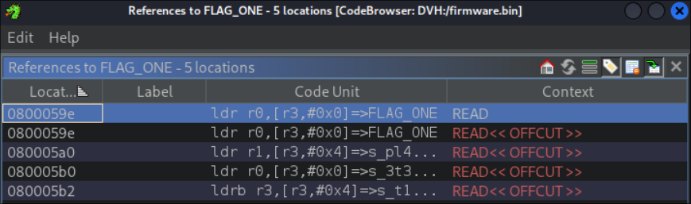
</p>

Double click that reference to navigate to the corresponding block of code :

<p align="center">
  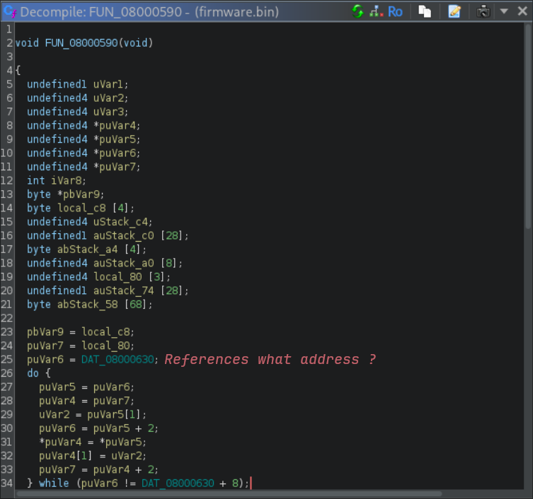
</p>

We have been taken into a function, which means there is now decompiled C-like code on the right section of the screen. By taking a look at the code, we cannot see any direct reference to `FLAG_ONE` in the decompiled code (we can see it in disassembly but that is no big deal). However, when looking at `DAT_08000630` (`[Double Click]`), we can see it is actually a pointer to the address holding `FLAG_ONE`. We will rename it to `flag_one_ref` :

<p align="center">
  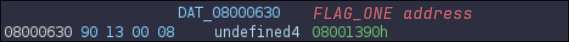
</p>

By scrolling through the function again (if you cannot find it, search for `FLAG_ONE` references again), we see two more `DAT` values (`DAT_08000634` and `DAT_08000638`). We can follow the pointers again (`[Double Click]`), and land on obfuscated hex values.

We cannot really make sense of these hex values, so they are probably encrypted. However, we notice that the second pointer leads exactly right after a null byte `0x00`, the string terminator we mentioned earlier ! Scrolling below the second pointer eventually leads to `0x00` as well.

<p align="center">
  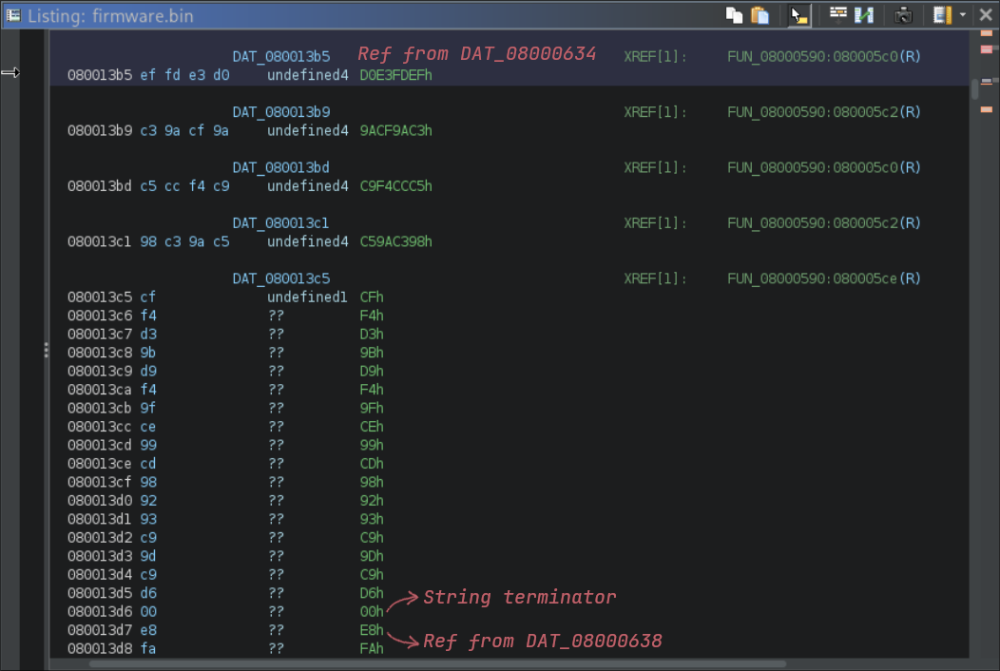
</p>

We are going to group the bytes and apply labels to make it easier to read. Select the first encrypted string (from `ef fd` to `d6 00`), and define it as a byte array with `[Right Click] > Data > byte` then `[Right Click] > Data > Create Array`. Do the same for the second encrypted string (`e8 fa` to `a4 00`), then set labels to both byte arrays and initial pointers.

<p align="center">
  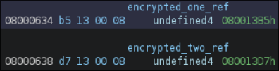
</p>

Now if you go back to the decompiled function that contained all the pointers (`FUN_08000590` in this case), you will understand a bit more about the function thanks to the labels :

<p align="center">
  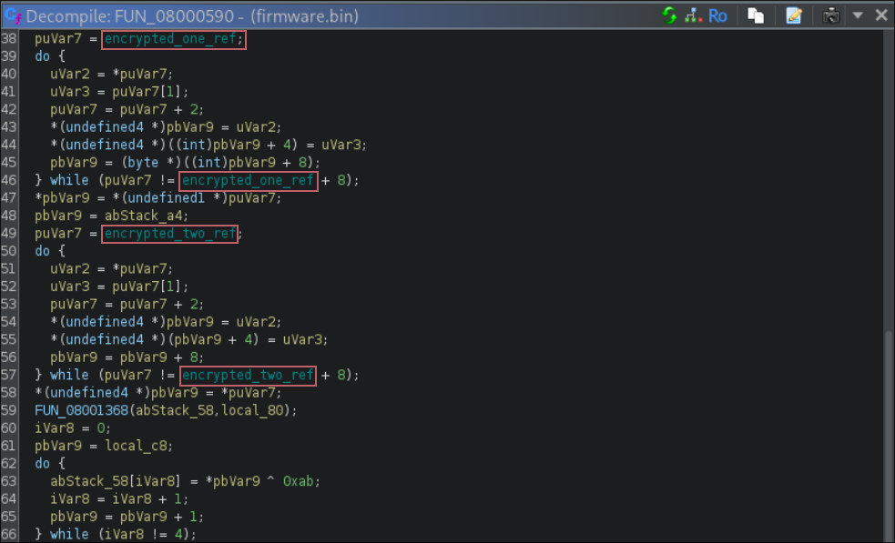
</p>

We are now going to try and understand the function's behavior. For now, we will focus on the uses of `encrypted_one` only, and overlook anything else, because there is quite a lot of intelligible code, and we want to go straight to the point.

We will skip this step because it is kind of trial and error, and it is always tedious to understand decompiled code, but after renaming a couple variables to what they could potentially be used for, we see that the `encrypted_one` variable is used in this loop. This is certainly the decryption step for the string :

<p align="center">
  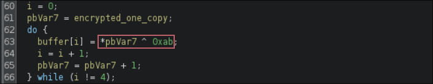
</p>

We notice that an iterator reads the string and applies `^ 0xab`, which is the XOR operator, with the given key `0xab`. We can head back to the byte array that we had defined earlier (`ef fd` to `d6 00`), and copy its content (`[Right Click] > Copy Special > Byte String`). With this data, the only thing that is left is head over to our favorite decryption tool, [Cyberchef](https://gchq.github.io/CyberChef/) (you can still use Python if you are comfortable with it). We can add a XOR formula, and enter the correct key to retrieve the second flag.

> We first have to decode the data with the `From Hex` item. You can also strip the `0x00` since it does not contain any data.

<p align="center">
  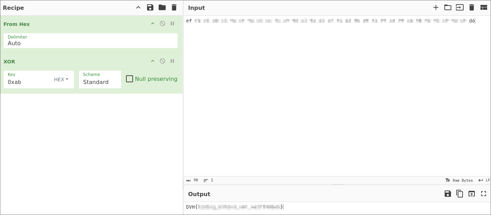
</p>

Great, only one more to go ! By reading through the end of that same decompiled function and renaming variables if necessary, we will come across this loop, that looks strangely similar to the decryption formula for flag two.

<p align="center">
  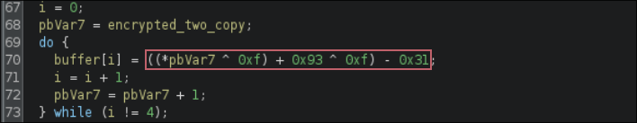
</p>

Following the same steps, we can retrieve the third flag, by throwing in the `ADD` and `SUB` formulas with the right offset.

> Your turn ! The Cyberchef recipe has been intentionnally blurred. Can you decrypt these bytes ?

<p align="center">
  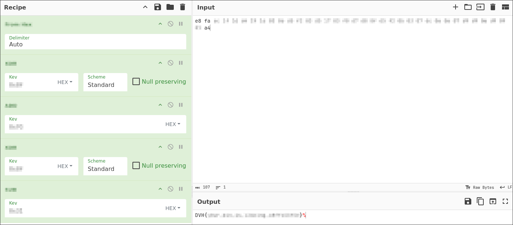
</p>

Congratulations, you have found all flags and successfully completed this lab !
