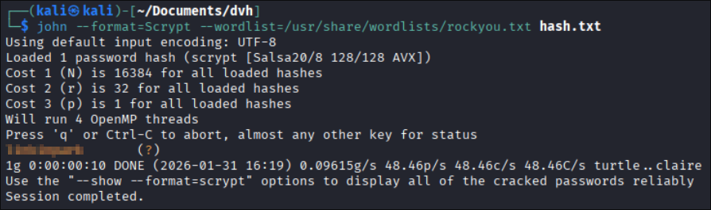

# UART lab walkthrough

## Overview

## Walkthrough

### Set up

Before starting the lab, you will need to have a functional [Debugprobe](../../tools/debugprobe.md). If you already performed the [SWD lab](../00_swd), you should already have one and be ready to get started.

We will have to connect the DVH board's UART interface with the corresponding Raspberry Pi Pico to allow them to communicate accordingly :

| DVH     | Pico |
|---------|------|
| UART_RX | GP4  |
| UART_TX | GP5  |
| GND     | GND  |

You may need to take a look at the pinout for both the DVH board and the [Raspberry Pi Pico](https://www.raspberrypi.com/documentation/microcontrollers/pico-series.html). As per UART standards, a circuit sends data through its `TX` pin, which is received by the other circuit on its `RX` pin.

### Initial access

In order to establish a serial communication over UART, we will start by installing `minicom` :

```
sudo apt install minicom
```

> Feel free to choose any other alternative such as PuTTY for example.

You can now power on the Pico and the DVH board, then open the serial port using `minicom` :

```
minicom -b 115200 -o -D /dev/ttyACM0
```

Once inside the `minicom` interface, press `[ENTER]` to start receiving the UART shell prompt, as well as the first flag !

(image)

> The Raspberry Pi Pico is usually listed as `ttyACM0`, but you can make sure of it by running `ls /dev/tty*`.

### User escalation

By playing around in the terminal, we can see that this looks like a standard shell, maybe even bash ? We can type common commands, such as `ls`, `pwd`, `whoami` to verify if it is truly a Linux shell :

(image)

Unlike we expected, we are not in a traditional shell environment. The system tells us that the `help` command does exist, let's run that :

(image)

This looks promising, we have access to built-in commands to log in and list existing users ! Let's see what we can find there :

(image)

We successfully learned that there are two users on the system, `root` and `monitoring_svc`. However, we cannot directly log in as the root user, so we will have to pivot to `monitoring_svc` first. Unfortunately, it is guarded by a password, and it does not seem like any of the available commands can help us here.

If you are familiar with network equipments and IOT devices, you might remember they regularly use logging over serial connections, to print debug information for example. What we could do here, is to keep listening on our `minicom` session, and reset the power on the DVH board by unplugging it then plugging it back on. Interesting logs will start to appear :

(image)

If we scroll all the way up and take a close look, we will observe that some credentials have actually been leaked ! We can now safely log in as the `monitoring_svc` user and obtain the second flag :

(image)

### Root escalation

We have now gained user privileges, which means we probably have access to new commands now ! Let's type `help` to verify that :

(image)

We now have access to the `root` command which is noticeably guarded by a password :

(image)

We can also observe that the `user_db` command was unlocked. By reading its usage, it seems pretty interesting to dump the database's contents :

(image)

Unfortunately, we were not able to retrieve plain passwords, but we managed to get the next best thing, which is a password hash for the root user !

> In case you are unfamiliar with the concept, a hash is a one-way encryption method that is commonly used for password authentication. Since a hash can be computed from the original password, you only need to store the hash to verify that it matches the given password's hash.

By inspecting the hash format, we can see it is formatted like a [Linux password](https://man7.org/linux/man-pages/man3/crypt.3.html), which typically looks like this :

```
$id$salt$hashed
```

From there, we can identify the hashing function corresponding to ID 7. According to `libxcrypt`, the modern Linux hashing library ([source](https://github.com/besser82/libxcrypt/blob/develop/lib/hashes.conf)), we find that this value corresponds to `scrypt`.

Unfortunately, unlike some obsolete hashing functions like MD5, `scrypt` is considered safe and cannot be broken. However, even if we cannot reverse the hash, nothing is preventing us from brute-forcing it, by computing the hash for common passwords and seeing if any of them matches ! To help us with that, we will swap over to our Linux machine and install John The Ripper, a handy password cracking tool :

```
sudo apt update
sudo apt install john
```

John expects hashes to be inside a file, so we can paste our hash into a new `hash.txt` file (you will need to escape the `$` signs by placing a `\` before each of them). We also know the hashing function is `scrypt`. The only thing that is left is to find a wordlist, containing common passwords that will be tested against the hash. The one we will use is one of the most famous wordlists, which comes from a huge data breach from [RockYou](https://github.com/zacheller/rockyou) :

```
wget https://raw.githubusercontent.com/zacheller/rockyou/master/rockyou.txt.tar.gz
tar -xzvf rockyou.txt.tar.gz
```

> If you are using a Kali Linux machine, that wordlist is already stored as `/usr/share/wordlists/rockyou.txt`

Now, we can simply pass the hash, the hashing function, and the wordlist to John, and wait for it to return the password :

<p align="center">
  
</p>

The hash has been successfully brute-forced, and the string in orange is our plaintext password. Let's use that to authenticate as the root user :

(image)

Congratulations, you have found all flags and successfully completed this lab !
