# I²C lab walkthrough

## Overview

This is a complete walkthrough of the UART lab, that is meant to guide you through every step of the way. You can read through this document to perform the lab, but for educational purposes, it is strongly suggested to use the [instructions](./instructions.md) as a main roadmap, and come back here whenever you feel stuck or need a sanity check.

> By this point, I assume that you have read through the instructions and understood the goal of this lab.

## Walkthrough

### Initial access

After initializing the EEPROM as explained in the [instructions](./instructions.md), this lab can be started by connecting to the UART shell, as detailed in the [UART lab](../01_uart/walkthrough.md).

Upon entering the shell, we notice an interesting piece of information :

<p align="center">
  
</p>

When executing the `help` command, only a few commands are available. The only command that seems interesting is `login`, which we can try to gain info on the authentication process :

<p align="center">
  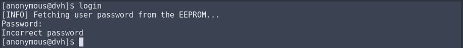
</p>

With these clues, we now have strong reasons to believe that the password would be transmitted over the I²C bus. We can now try to listen to the communication in order to retrieve the password.

### Eavesdrop on the I²C bus

In order to sniff the data that is transmitted on the bus, we will need to configure our [logic analyzer](../../tools/logic_analyzer.md) environment. From this point, it is assumed that the Pico and Pulseview are both set up.

Since the I²C protocol uses a fixed frequency of 100kHz, using a sampling rate of 1MHz is a good baseline. The max sample count will depend on your use case, 1M sample being equals to 1 second of sampling. Increase that as high as you wish, keeping in mind that more samples means more memory consumption (though you should be fine for ranges of a couple of minutes). You can configure those parameters in the toolbar :

<p align="center">
  
</p>

In this particular lab, our I²C target is a M24C02 EEPROM. Luckily, PulseView is shipped with a built-in decoder for these exact EEPROM communications ! This will make the data sniffing considerably easier for us, because the ROM-specific instructions will also be decoded for us. It can be found from the `Add protocol decoder` (green and yellow icon) menu, under the name `24xx EEPROM` :

<p align="center">
  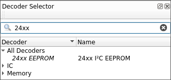
</p>

Double click on it and press `Ok` with default parameters if a prompt shows up. You should now see a new channel at the bottom of the main window. Next, we will need to configure the decoder to use the corresponding signal channels, and decode for our particular M24C02 target chip :

<p align="center">
  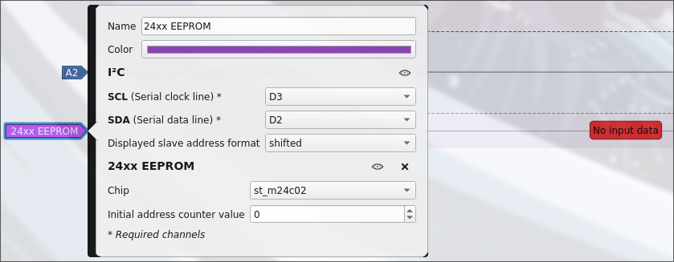
</p>

We are now ready to power on the board and sniff the I²C data ! Don't forget to press the `Run` button before plugging in the cable. If everything goes well, you will be able to see a similar trace :

<p align="center">
  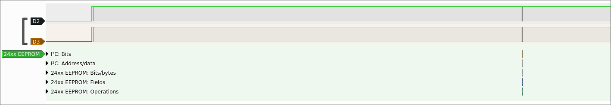
</p>

If we zoom on the spike in the center of the trace, we can detect I²C signals have been transmitted on the bus ! As seen on the picture below, the STM32 has read data from the EEPROM, and the data bytes were successfully dumped by PulseView :

<p align="center">
  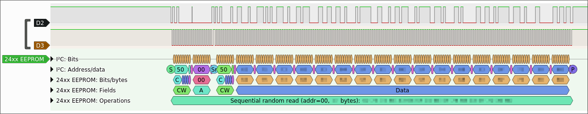
</p>

Those hex bytes can be decoded with tools like [Cyberchef](https://gchq.github.io/CyberChef) to reveal an interesting string.

Because the UART logs told us that the system queried the user password, we can infer this string would grant us user access. Let's go ahead and enter it in the UART shell :

<p align="center">
  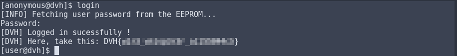
</p>

### Gather clues

Once we are logged in as a user, we can look for new commands that are available with `help`. We notice the `root` command that should be our way out of this challenge, let's type that first to see if anything interesting shows up :

<p align="center">
  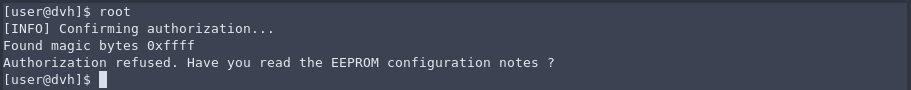
</p>

We get a very cryptic clue about magic bytes and configuration notes. That's a good start, but we will need more information to continue. Let's take a loot at the `coffeee` command. At first, it seems insignificant, but if we use the `--facts` argument, we will come across an unexpected piece of information :

<p align="center">
  
</p>

We now have some more information on the magic bytes that need to be found by the `root` command, their value would likely be `0xcafe`. However, we are still missing a piece of the puzzle, where should we write those magic bytes ? Since the `root` prompt mentioned reading the "EEPROM configuration notes", we can attempt to perform a full read of the EEPROM contents, to see if it holds anything interesting.

### Full memory dump

In order to perform an arbitrary read of the EEPROM, we are going to need to program a device to talk I²C with our target. One straight-forward way to do that is to write a [MicroPython](../../tools/micropython.md) script for the Raspberry Pi Pico.

> You can safely exit the UART shell and come back to it later without losing your progress if you leave the DVH board powered on. If not, make sure to take notes of the password to get back to this step easily.

In every I²C communication, the master has to address a slave with the corresponding device select code. Like we have seen in PulseView, and can confirm using the [M24C02 datasheet](https://www.st.com/en/memories/m24c02-w.html) (section 4.5, `Device addressing`), the device select code is `0x50` :

<p align="center">
  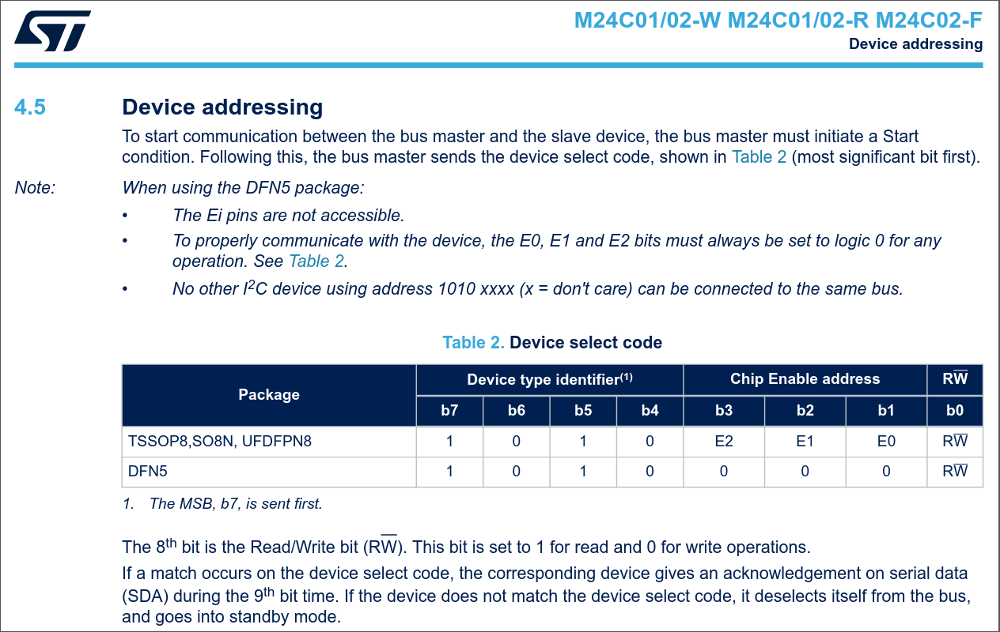
</p>

> The original bits are `10100000`, which is equal to `0xa0`. However, since last bit is used for the Read/Write identifier, the address is shifted right by one bit, and becomes `01010000` (`0x50`).

Thanks to the high-level I²C API provided by the `machine` library, we can use the `readfrom_mem()` method to dump all the bytes contained in the EEPROM.

> I recommend you to go through the process of writing the script yourself (ideally without external LLM help), and peeking at the example solution below if you feel stuck. This is not a safe and error-proof script, but it provides the stripped out logic to dump the memory.

<details>
<summary>Click to open</summary>

```python
import machine

sda = machine.Pin(2)
scl = machine.Pin(3)

i2c = machine.I2C(1, sda=sda, scl=scl, freq=100000)
dump = i2c.readfrom_mem(0x50, 0x00, 256)

# Display ASCII-printable characters or '.'
print("".join([chr(d) if 32 <= d <= 126 else "." for d in dump]))
```

</details>

<p align="center">
  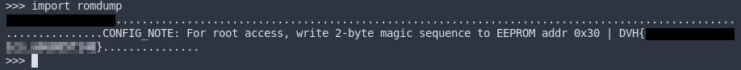
</p>

Running your script should return a similar dump. As we could have hoped for, the EEPROM does contain the config note ! This rewards us with the exact address where we should write the magic bytes, and the second flag. Our next task will be to figure out how to overwrite part of the EEPROM.

> Note that the first dumped bytes are the user password that we sniffed earlier ! It makes sense that it would also be stored in the EEPROM.

### Arbitrary write

To summarize all the clues we have gathered, our goal is to write `0xcafe` at offset `0x30` of the EEPROM. This can also be achieved by instrumenting the `I2C` class from the `machine` library.

> Same comment as the previous script, it is recommended to perform this step yourself, but feel free to peak at the solution if you feel stuck.

<details>
<summary>Click to open</summary>

```python
import machine

sda = machine.Pin(2)
scl = machine.Pin(3)

i2c = machine.I2C(1, sda=sda, scl=scl, freq=100000)
i2c.writeto_mem(0x50, 0x30, b'\xca\xfe')

magic = i2c.readfrom_mem(0x50, 0x30, 2)
print(f"Bytes at 0x30 are 0x${magic.hex()}")
```

</details>

This script should be able to burn the correct bytes into the storage. However, if we execute it, we will notice that the write has not been successfully performed, as shown in the script output :

<p align="center">
  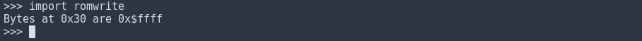
</p>

This comes from a particular feature of the M24C02, and although the script did not throw an error, we see it did not work correctly. In fact, if we analyze the EEPROM datasheet, we can notice that there is a `WC'` (Write Control) pin, active on low state :

<p align="center">
  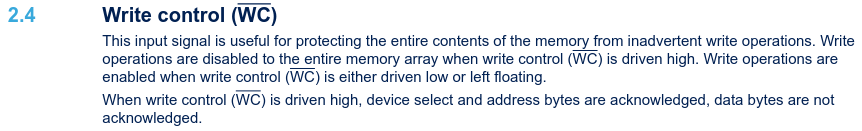
</p>

With this information, we need to make sure that the `WC'` is pulled low, which you will find is not the case by default. Luckily, we notice that there is a test point linked to that exact pin ! We only need to wire a pogo pin or a curved wire to ensure that the copper pad is connected to `GND` to enable Write Control.

Executing the write script with Write Control enabled will successfully write the correct magic bytes at offset `0x30` :

<p align="center">
  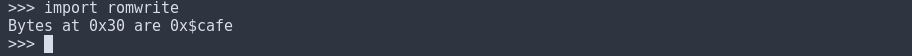
</p>

Once this is done, we can hop back into the UART shell to log in as root :

<p align="center">
  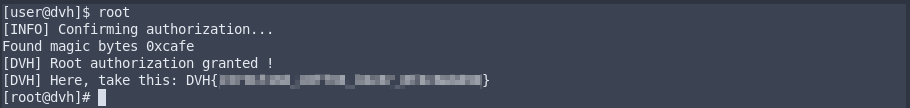
</p>

Congratulations, you have successfully rooted the I²C lab !
