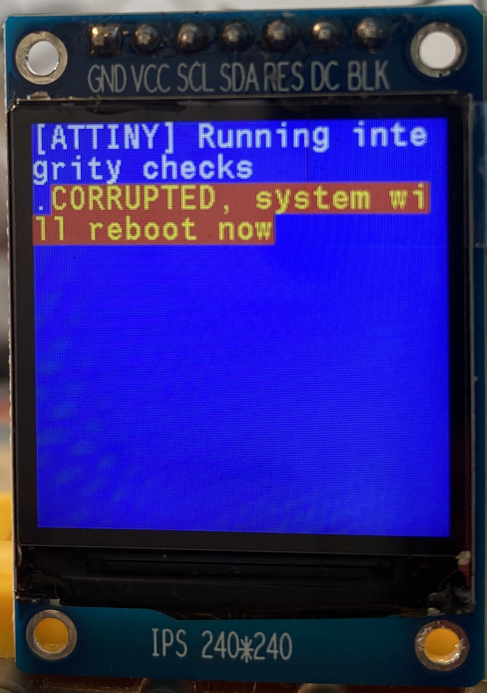
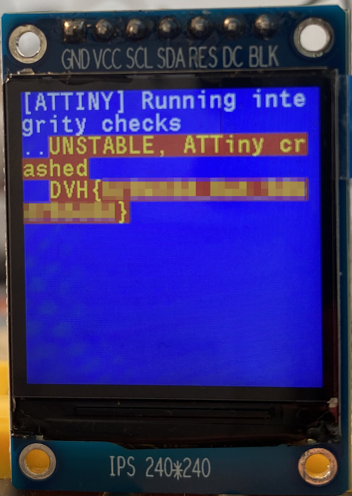
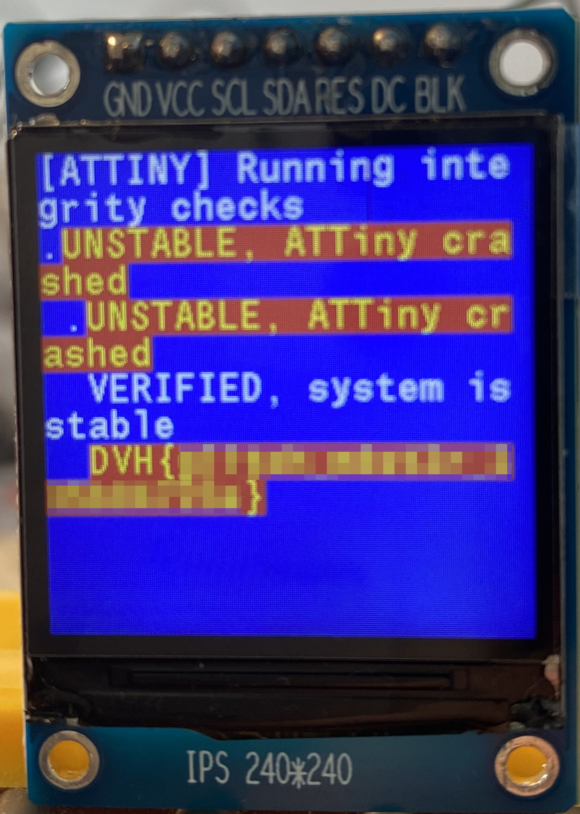

# Voltage Glitching lab walkthrough

## Overview

> This walkthrough is still Work In Progress, and some steps need to be explained more in depth, but it is complete enough to give you a working solution.

This is a complete walkthrough of the Voltage Glitching lab, that is meant to guide you through every step of the way. You can read through this document to perform the lab, but for educational purposes, it is strongly suggested to use the [instructions](./instructions.md) as a main roadmap, and come back here whenever you feel stuck or need a sanity check.

> By this point, I assume that you have read through the instructions and understood the goal of this lab.

## Walkthrough

### Dump the firmware

When starting this lab, the first thing we notice is the screen going crazy with "CORRUPTED" messages :

  

By examining the [ATTiny firmware](./assets/attiny.bin), we notice that right before performing the check, it methodically raises its `PB4` pin. That is the trigger we can attach to.

### Set up

When looking at the PCB, we can see that the `VCC` pin is connected to a MOSFET transistor. Even better, there is a pin header that is linked to that MOSFET, which allows us to drop the ATTiny's power supply when that pin header goes high.

We can thus place two wires going from the Pico :

|      **DVH**     | **Pico** |              **Note**              |
|:----------------:|:--------:|:----------------------------------:|
| ATTiny_PB4 / TP3 | GP17     | /                                  |
| J8_left          | GP13     | Place a 5.1K (or similar) resistor |

### Perform glitch

Using the [Glitcher script](./assets/glitcher.py), we can fire the MOSFET pin whenever the TRIGGER pin goes high, after a delay that we can calculate based on the number of CPU cycles performed before the instruction we want to bypass.

The width can be found by trial and error. The idea is to find a width that is at the edge between "too wide", which crashes the ATTiny all the time, and "too narrow", which does not induce faults. When the ATTiny crashes sometimes, but not too often, 50-50 for example, the width is a sweet spot to attempt glitching.

The first time the ATTiny browns out, the first flag will be printed on the screen along the "UNSTABLE" mention :

  

When you finally manage to perform the glitch and skip the correct CPU instruction, the system will be marked as "VERIFIED", and the second flag will be printed :

  

> The parameters that specifically worked for me are : 5.1K ohm resistor, width 328, delay 110450. A good corresponding command for the glitcher script would be `autosweep2d 105000 10 323 333`.
