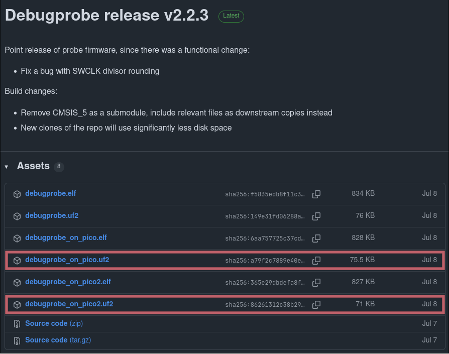
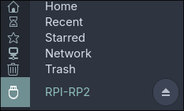
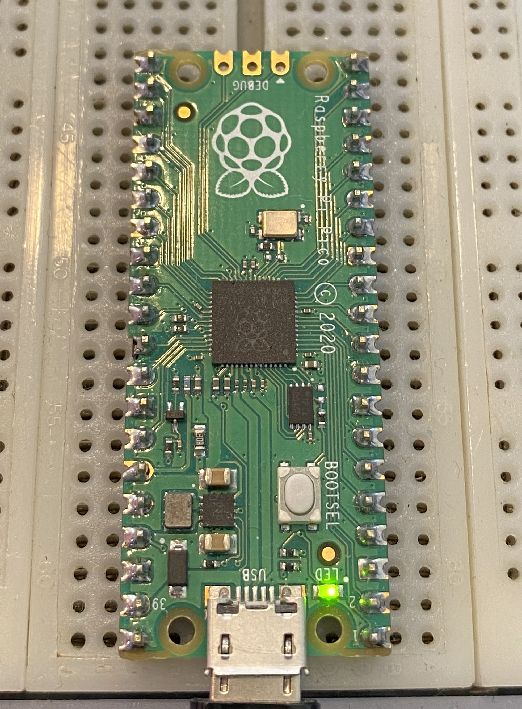

# Setting up the Raspberry Pi Pico as a debugger with Debugprobe

Debuggers are very powerful tools that are commonly used in hardware development and hacking. It allows engineers and attackers to debug, capture and interact with serial interfaces from embedded devices. There are a lot of existing tools that can function as debuggers to program and interact with circuits, for example the ST-Link that is tailored for STM32 chips (the DVH board's main MCU). However, for logistical reasons, it is easier for us to repurpose a Raspberry Pi Pico board into a functional debugger.

Raspberry Pi have developed open firmware for debugging, available for both their [Raspberry Pi Debug Probe](https://www.raspberrypi.com/products/debug-probe/) and the [Raspberry Pi Pico](https://www.raspberrypi.com/products/raspberry-pi-pico/), which is the solution we will be using in the context of this course. Although this documentation will be focused around the Pico, feel free to use any circuit debugger compatible with OpenOCD.

## Required materials and equipment

- Computer
- Raspberry Pi Pico
- Micro-USB to USB/USB-C cable (depending on your computer's ports)

## Download firmware

The UF2 firmware that we will be using can be found in the official Debugprobe (formerly Picoprobe) GitHub repository under the [Releases](https://github.com/raspberrypi/debugprobe/releases) section.

Depending on your Pico's series, you will need to choose between `debugprobe_on_pico.uf2` and `debugprobe_on_pico2.uf2`. Latest version by the time of writing this article is v2.2.3, but you should probably choose whichever version is up to date.

## Flash the Pico

The Raspberry Pi Pico is quite simple to flash firmware on. Before powering it up, hold the `BOOTSEL` button. While holding the button, plug in the cable linked to your computer. If done correctly, you should now see the Pico as an external peripheral in your file explorer.

You may now drag and drop or paste the UF2 firmware on the Pico, which will disappear from the peripheral list. If the Pico's internal LED lights up, you are good to go !

