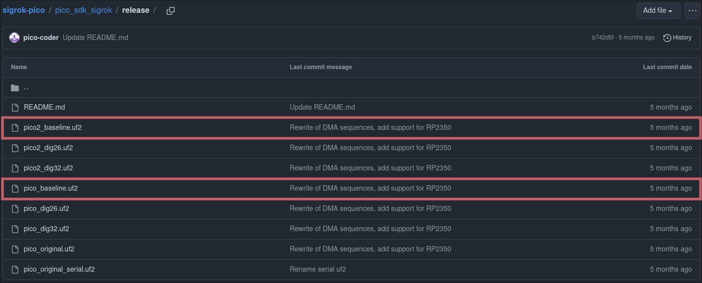
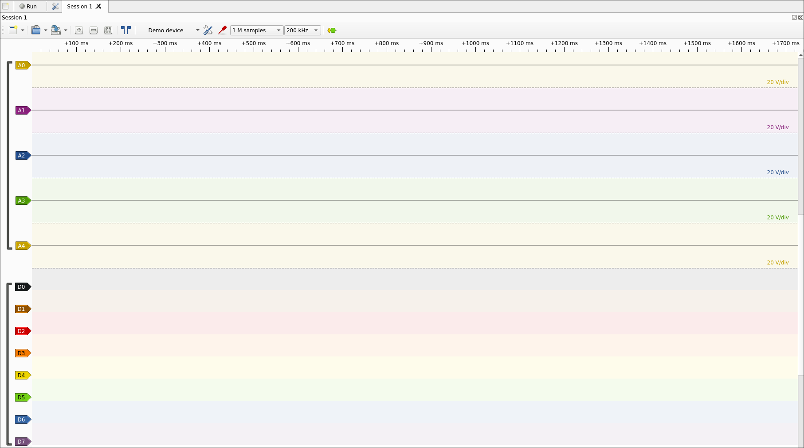
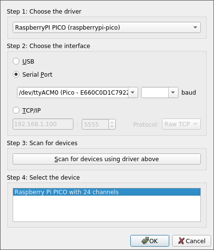

## Setting up the Raspberry Pi Pico as a logic analyzer

Logic analyzers are instruments that can capture signals emitted by digital circuits. It is often used for debugging IOT devices, and in our case, sniff data that flows through different parts of a circuit to reverse engineer its internal behavior. 

The Raspberry Pi Pico can be used as a cheap logic analyzer thanks to the [sigrok](https://sigrok.org/wiki/Main_Page) project. It provides driver firmware to exploit the Pico's capabilities to sniff and record data signals.

The data that is received by the logic analyzer can be displayed and decoded in dedicated software, such as [PulseView](https://sigrok.org/wiki/PulseView), the open-source solution we will be using. An example popular premium solution is [Saleae Logic](https://www.saleae.com/logic), and many other cheap solutions also exist.

## Required materials and equipment

- Computer
- Raspberry Pi Pico
- Micro-USB to USB/USB-C cable (depending on available ports)

## Download and flash firmware

The firmware we will use for the Pico is `sigrok-pico`. Download the corresponding [release](https://github.com/pico-coder/sigrok-pico/tree/main/pico_sdk_sigrok/release) from their repository. You will likely want to grab `pico_baseline.uf2` or `pico2_baseline.uf2`, depending on the Pico generation.

<p align="center">
  
</p>

Once the firmware is downloaded, flash it on the Pico by holding its `BOOTSEL` button when powering it on, and copying the UF2 file to the Pico peripheral. This step is explained in greater details in the [debugprobe](./debugprobe.md) setup.

## Install PulseView

We can now install the analyzer software, from which we will be able to view the signals received by the Pico. On Linux, the recommended option is to download the Nightly build `AppImage` from the official [downloads page](https://sigrok.org/wiki/Downloads) :

```
chmod u+x pulseview-NIGHTLY-x86_64-debug.AppImage
./pulseview-NIGHTLY-x86_64-debug.AppImage
```

> The `apt` package and Release build do not feature the Pico driver, which is why the Nightly version is preferred.

> `sigrok-pico` provides an unofficial [Windows installer](https://github.com/pico-coder/sigrok-pico/tree/main/pulseview), which I have not tested. In addition, Windows hosts are said to run into driver issues with this setup. Using a Linux host or VM will definitely be simpler.

Once installed, you can start the GUI from your application menu or by executing the `pulseview` command :

<p align="center">
  
</p>

## Connect the Pico

In order to configure PulseView to receive input from the Pico, click on the arrow right next to `Demo Device`, then click on `Connect to Device...`, which will open a dialog box. Select the corresponding `RaspberryPI PICO` driver over your interface (on Linux it will most likely be `/dev/ttyACM0`). Scan for the device and select it. The baud rate does not matter.

<p align="center">
  
</p>

PulseView is now correctly set up ! Depending on the situation, you would typically need some more configuration. The corresponding steps will be covered directly in those documents.
