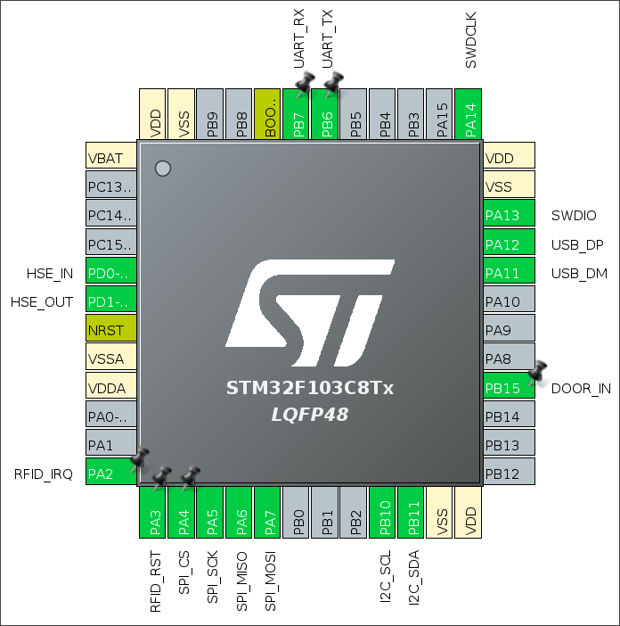
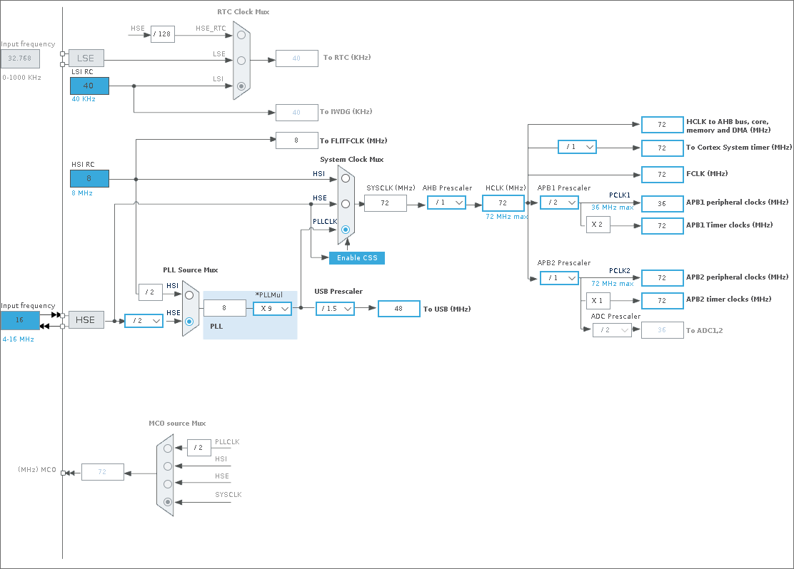

# Configuring the toolchain

This document will guide you through setting up the environment required to develop and build firmware for the DVH board. If your goal is to perform the labs and practice on the vulnerabilities of the board, this document is probably not for you, and you may want to download the [precompiled versions](https://github.com/Sleeeee/dvh/releases) of the DVH firmware.

## Required materials and equipment

- Computer (configuring and building)
- Everything listed in the [flashing guide](./flash.md) (flashing, optional)

## Install dependencies

Building the firmware from source requires multiple dependencies, such as a software building system (`cmake`), a cross-compiler that can build ARM machine code (`gcc-arm-none-eabi`) and a multi-architecture debugging server (`gdb-multiarch`) :

```
sudo apt update
sudo apt install cmake build-essential gcc-arm-none-eabi libnewlib-arm-none-eabi gdb-multiarch usbutils
```

To prepare for the next step, you may want to install [STM32CubeMX](https://www.st.com/en/development-tools/stm32cubemx.html), though this step is not strictly necessary if you do not need to modify the microchip's hardware configuration.

## Configure STM32CubeMX

STM32CubeMX is software designed to abstract all the STM32 firware's boilerplate code generation from the user, by allowing them to simply define the hardware capabilities they need, and generating the initialization code by itself. As said previously, it is likely that you would not need to perform this step yourself, as the repository already contains the boilerplate code, though it might be interesting to gain knowledge of how it is generated.

Once you have opened STM32CubeMX, you can first create a new project and select the STM32F103C8Tx chip, or open an existing `.ioc` file. You will then be sent to the `Pinout & Configuration` menu, where you will be able to lay out all the desired protocols and interfaces to the chip's actual pins.

<p align="center">
  
</p>

Once this is taken care of, we can head on to the `Clock Configuration` tab. It will likely have conflicts by default, but that is no big deal. Since we are using a High Speed External (HSE) crystal oscillator for the board, it is very important to choose its corresponding clock frequency. We have chosen the STM32F103C8T6's maximum supported clock frequency of 16 MHz. You can now prompt the program to resolve clock issues, and it will do its best at defining each item's frequency. Key frequencies to watch out for are :

- Input frequency : 16 MHz (crystal oscillator maximum frequency)
- HCLK : 72 MHz (MCU maximum frequency
- PLLMul : x9 (needed to end up with a 72 MHz output)
- APB1 peripheral clocks : 36 MHz
- APB2 peripheral clocks : 72 MHz
- USB clock : 48 MHz

<p align="center">
  
</p>

The last thing is to configure the project settings under the `Project Manager` tab. There is not much to do, I personally named the project `firmware` (top-level subfolder of this repository), and chose the CMake toolchain option. Everything is now set up, and you can click the `Generate code` button on the top right, and as mentioned previously, STM32CubeMX will generate all the boilerplate code required to start developing.

> I chose to develop using neovim and to build the firmware with CMake because it fits my personal workflow best. Do note that STMicroelectronics have developed an Eclipse IDE fork called [STM32CubeIDE](https://www.st.com/en/development-tools/stm32cubeide.html) to provide a fully integrated development environment, but we will not be using that in this toolchain.

## Develop

You are now ready to write code for DVH ! This step will not be covered in this document.

## Build

Once you have finished writing code for the DVH board, you can use the preconfigured toolchain and run these two commands from inside the `firmware/` directory to build both `.elf` and `.bin` binaries :

```
cmake -B build -DCMAKE_TOOLCHAIN_FILE=cmake/gcc-arm-none-eabi.cmake
cmake --build build
```

> The first command only needs to be executed on the first run to configure the CMake toolchain. The second command is the one you will have to type every time. Note that `build/` is effectively a subdirectory of `firmware/`, that is why you need to enter it before running the command.

## Flash

Now that the binaries are built, we re ready to flash the DVH board. I suggest you go through the [flashing guide](./flash.md) for any instruction or advice given there because the process is highly similar, though there are a couple things that differ if you have built firmware from source.

The firmware will be in the `firmware/build/` location. There should be two binary files, a `.elf` and a `.bin`. Both can be used to flash the board, but the flashing document only explains the procedure for `.bin` (because `.elf` is machine-dependent and cannot be distributed).

Once you have configured OpenOCD and wire the debugger to the DVH board, you can use the custom `flash` target from CMake, which is executed with a simple command :

```
cmake --build build --target flash
```

This command will recompile the firmware if needed, so it can replace the original `cmake` command to perform both actions at once.

> Do note that the procedure for flashing the `.bin` is still valid if you prefer that.
